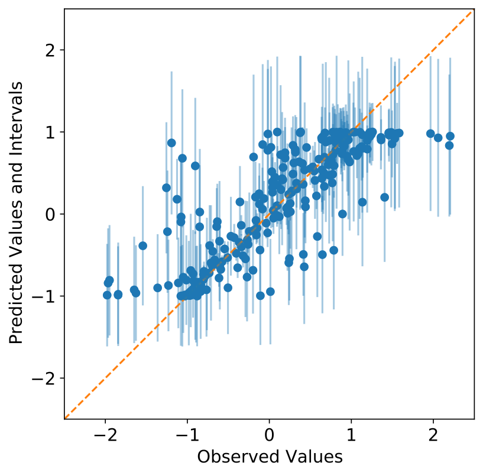
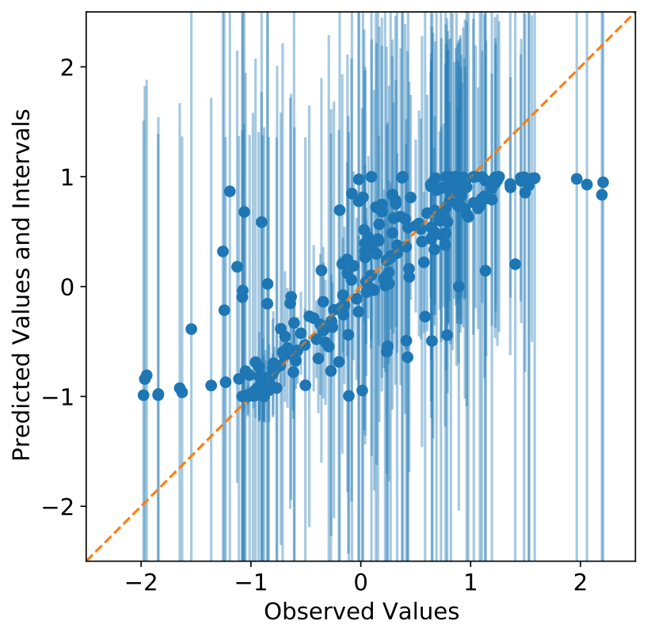
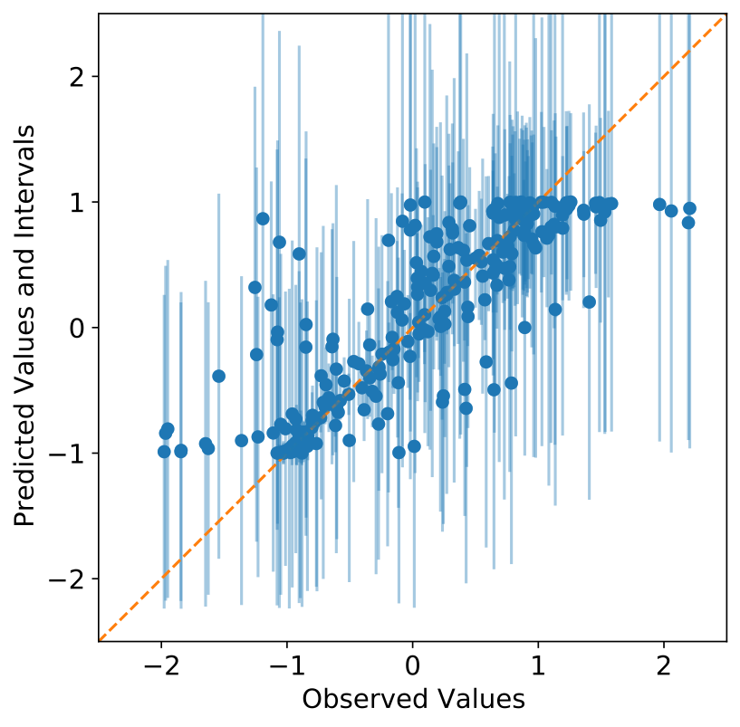

# Uncertainty Toolbox

<br/>

**Uncertainty Toolbox**
> A python toolbox for predictive uncertainty quantification, calibration, metrics, and
> visualization.\
> And a collection of [relevant papers and references](docs/paper_list.md).

<!--**A python toolbox for predictive uncertainty quantification, calibration, metrics, and visualization.**-->

&nbsp;\
Many machine learning methods return predictions along with uncertainties of some form,
such as distributions or confidence intervals. This begs the questions: How do we
determine which predictive uncertanties are best? What does it mean to produce a _best_
or _ideal_ uncertainty?

Uncertainty Toolbox provides standard metrics to quantify the quality of predictive
uncertainties, describes the intuition behind these metrics, produces visualizations of
these metrics/uncertainties, and implements simple post-processing procedures to improve
these uncertainties (i.e.  "re-calibration").  This toolbox currently focuses on
regression tasks.  We also aim to provide and maintain a reference list of [relevant
papers](docs/paper_list.md) in this area.


## Installation

Uncertainty Toolbox requires Python 3.6+. To install, clone and `cd` into this repo, and run:
```
$ pip install -r requirements/requirements.txt
```


## Quick Start
```python
import uncertainty_toolbox as ut

# Load example dataset of n=100 predictions, uncertainties, and observations
predictions, predictions_std, y, x = ut.data.synthetic_sine_heteroscedastic(100)

# Compute all uncertainty metrics
metrics = ut.metrics.get_all_metrics(predictions, predictions_std, y)
```
This example computes metrics for a vector of predictions (`predictions`) and respective
uncertainties (`predictions_std`, given here as a vector of standard deviations), taken
with respect to a set of observations `y`.


## Toolbox Contents
Uncertainty Toolbox contains:
* [Glossary](docs/glossary.md) of terms related to predictive uncertainty
  quantification.
* [Metrics](uncertainty_toolbox/metrics.py) for assessing quality of predictive
  uncertainty estimates.
* [Visualizations](uncertainty_toolbox/viz.py) for predictive uncertainty estimates and
  metrics.
* [Recalibration](uncertainty_toolbox/viz.py) methods for improving the calibration of a
  predictor.
* Relevant [publications and references](docs/paper_list.md).


## Visualize Uncertainties and Metrics

**Overconfident** (_too little uncertainty_)
<p align="center">



</p>

**Underconfident** (_too much uncertainty_)
<p align="center">



</p>

**Just right** (_well-calibrated_)
<p align="center">



</p>


## Citation

If you use this toolbox, please consider citing one of the papers that lead to
its development:
```
@article{tran2020methods,
  title={Methods for comparing uncertainty quantifications for material property predictions},
  author={Tran, Kevin and Neiswanger, Willie and Yoon, Junwoong and Zhang, Qingyang and Xing, Eric and Ulissi, Zachary W},
  journal={Machine Learning: Science and Technology},
  volume={1},
  number={2},
  pages={025006},
  year={2020},
  publisher={IOP Publishing}
}
```


## TODOs
* contents: metrics, visualizations, list of papers (+ descriptions?), example code
* unit tests
* documentation (readthedocs?) and examples of code/usage
* pip and pypi
* logo, etc
