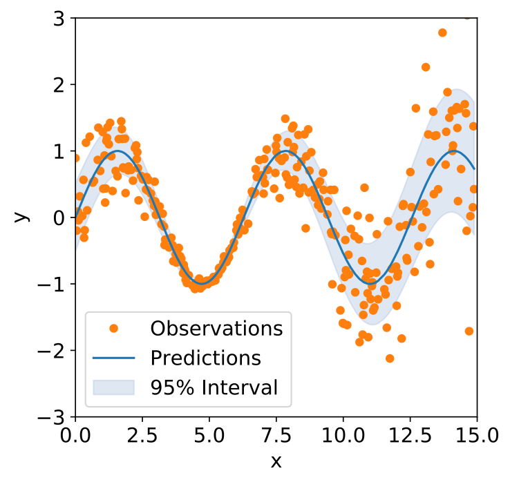
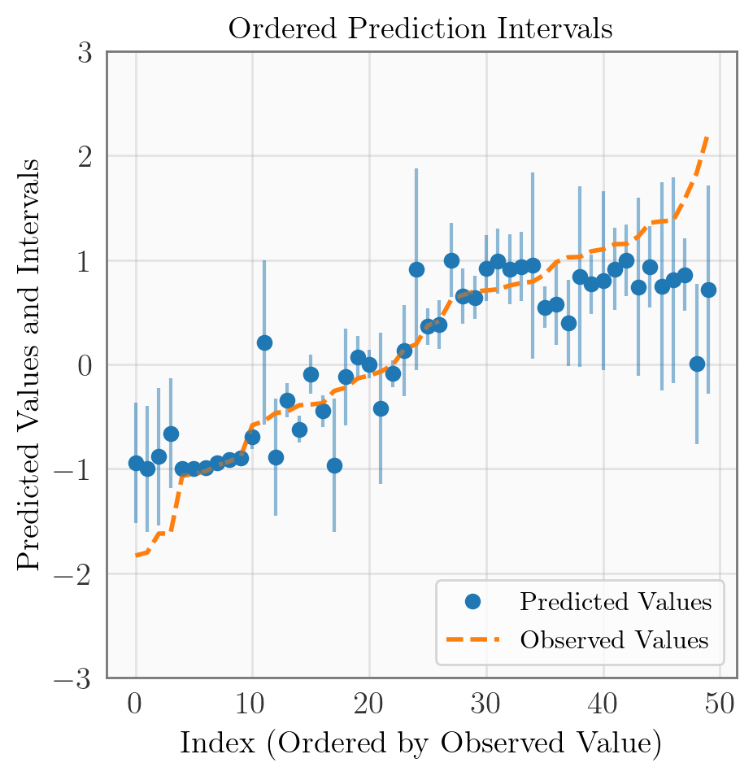
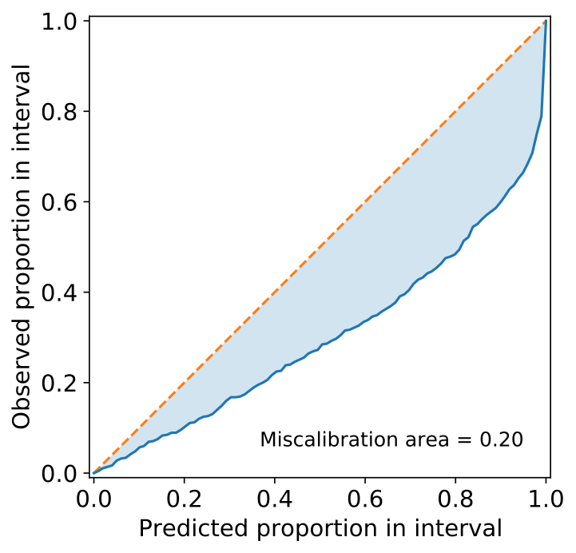
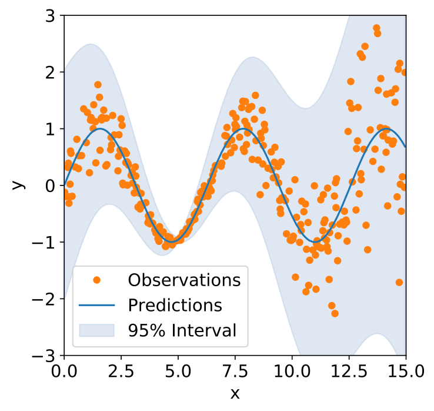
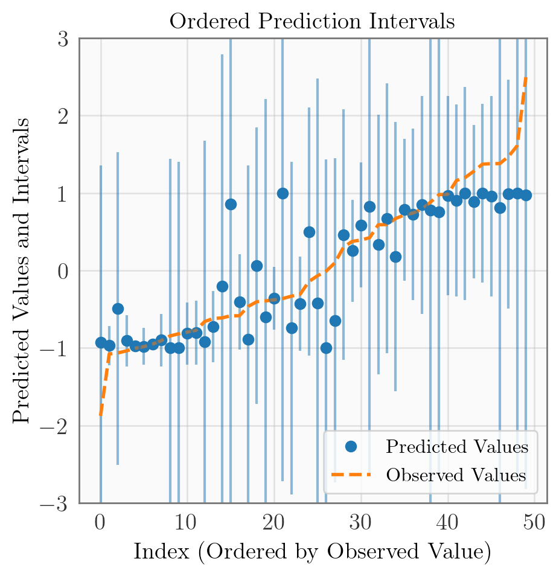
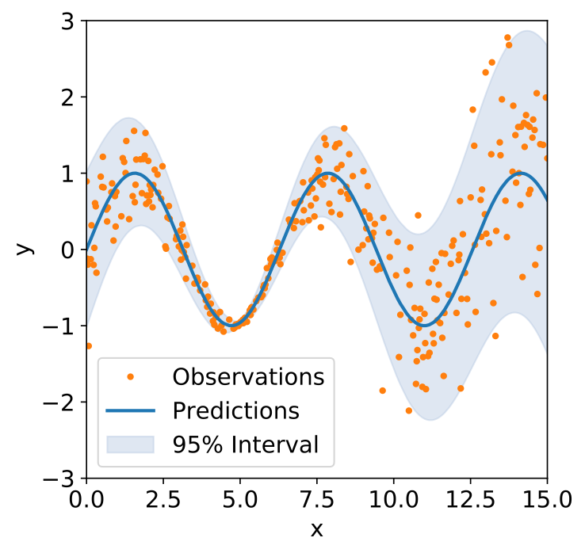
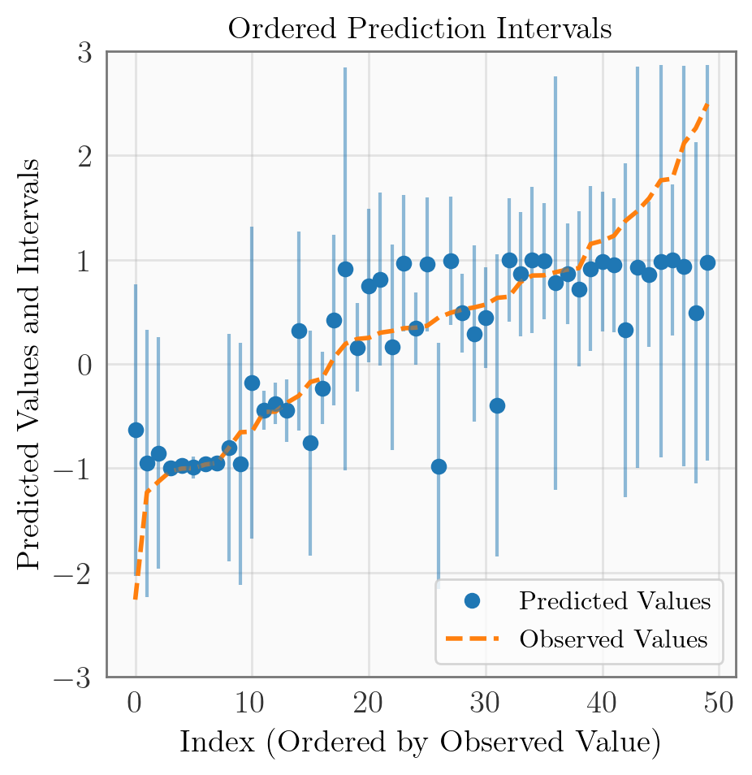
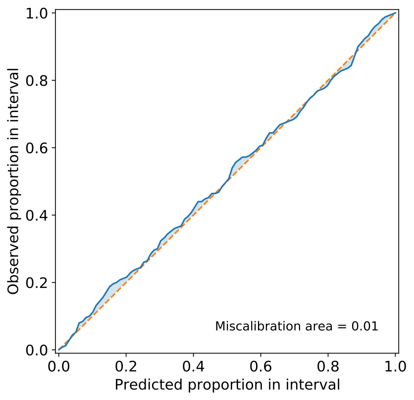

# Uncertainty Toolbox

<br/>

**Uncertainty Toolbox**
> A python toolbox for predictive uncertainty quantification, calibration,
> [metrics, and visualization](#quick-start).\
> Also: a [glossary of useful terms](docs/glossary.md) and a collection
> of [relevant papers and references](docs/paper_list.md).

<!--**A python toolbox for predictive uncertainty quantification, calibration, metrics, and visualization.**-->

&nbsp;\
Many machine learning methods return predictions along with uncertainties of some form,
such as distributions or confidence intervals. This begs the questions: How do we
determine which predictive uncertanties are best? What does it mean to produce a _best_
or _ideal_ uncertainty? Are our uncertainties accurate and _well-calibrated_?

Uncertainty Toolbox provides standard metrics to quantify and compare predictive
uncertainty estimates, gives intuition for these metrics, produces visualizations of
these metrics/uncertainties, and implements simple "re-calibration" procedures to
improve these uncertainties.  This toolbox currently focuses on regression tasks.  It
also aims to provide a [glossary of terms](docs/glossary.md) and to maintain a reference
list of [relevant papers](docs/paper_list.md) in this area.


## Installation

Uncertainty Toolbox requires Python 3.6+. To install, clone and `cd` into this repo, and run:
```
$ pip install -r requirements/requirements.txt
$ pip install -e .
```


## Quick Start

```python
import uncertainty_toolbox as uct

# Load an example dataset of 100 predictions, uncertainties, and observations
predictions, predictions_std, y, x = uct.data.synthetic_sine_heteroscedastic(100)

# Compute all uncertainty metrics
metrics = uct.metrics.get_all_metrics(predictions, predictions_std, y)
```
This example computes metrics for a vector of predicted values (`predictions`) and
associated uncertainties (`predictions_std`, a vector of standard deviations), taken
with respect to a corresponding set of observed values `y`.
The `get_all_metrics` function will return metrics for:
* __average calibration__
    - root mean squared calibration error, mean absolute calibration error,
      miscalibration area
* __adversarial group calibration__
    - root mean squared adversarial group calibration error, mean absolute adversarial
      group calibration error
* __sharpness__
    - expected standard deviation
* __proper scoring rules__
    - negative log-likelihood, continuous ranked probability score, check score,
      interval score
* __accuracy__
    - root mean squared error, mean absolute error, median absolute error,
      coefficient of determination, correlation


## Toolbox Contents

Uncertainty Toolbox contains:
* [Glossary](docs/glossary.md) of terms related to predictive uncertainty
  quantification.
* [Metrics](uncertainty_toolbox/metrics.py) for assessing quality of predictive
  uncertainty estimates.
* [Visualizations](uncertainty_toolbox/viz.py) for predictive uncertainty estimates and
  metrics.
* [Recalibration](uncertainty_toolbox/recalibration.py) methods for improving the calibration of a
  predictor.
* Relevant publications and references on [metrics](docs/paper_list.md) and [methods](docs/deep_uncertainty_papers.md)


## Metrics and Visualizations

**Overconfident** (_too little uncertainty_)
<p align="center">



</p>

**Underconfident** (_too much uncertainty_)
<p align="center">



</p>

**Just right** (_well-calibrated_)
<p align="center">



</p>


## Citation

If you use this toolbox, please consider citing one of the papers that led to its
development:
```
@article{chung2020beyond,
  title={Beyond Pinball Loss: Quantile Methods for Calibrated Uncertainty Quantification},
  author={Chung, Youngseog and Neiswanger, Willie and Char, Ian and Schneider, Jeff},
  journal={arXiv preprint arXiv:2011.09588},
  year={2020}
}

@article{tran2020methods,
  title={Methods for comparing uncertainty quantifications for material property predictions},
  author={Tran, Kevin and Neiswanger, Willie and Yoon, Junwoong and Zhang, Qingyang and Xing, Eric and Ulissi, Zachary W},
  journal={Machine Learning: Science and Technology},
  volume={1},
  number={2},
  pages={025006},
  year={2020},
  publisher={IOP Publishing}
}
```


## TODOs

* contents: metrics, visualizations, list of papers (+ descriptions?), example code
* unit tests
* documentation (readthedocs?) and examples of code/usage
* pip and pypi
* logo, etc
