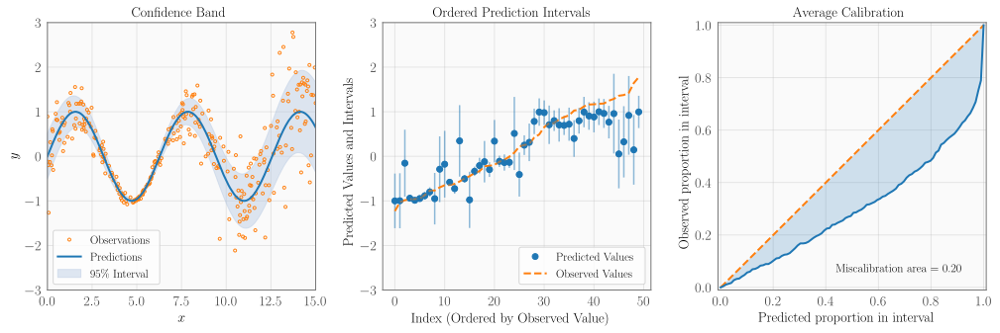
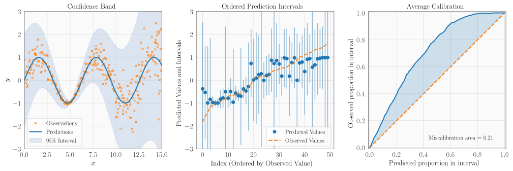
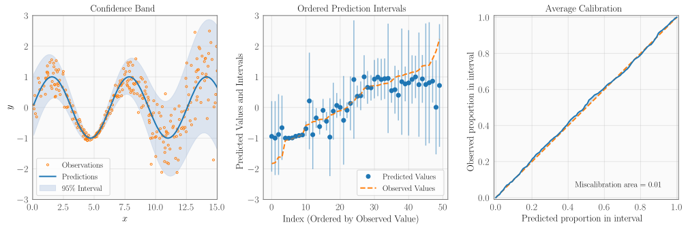
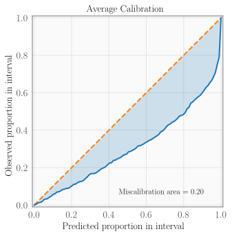
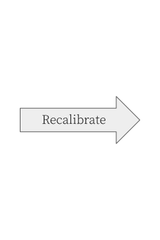
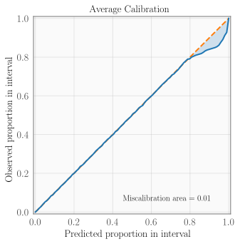
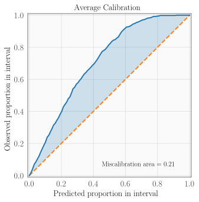
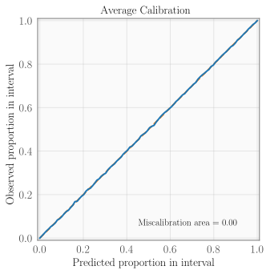

<p align="center"></p>

<p align="center">
    <a href="https://uncertainty-toolbox.github.io/">Website</a>,
    <a href="https://uncertainty-toolbox.github.io/tutorial/">Tutorials</a>, and
    <a href="https://uncertainty-toolbox.github.io/docs/">Docs</a>
    &emsp;&emsp;&nbsp;&nbsp;
</p>

&nbsp;\
**Uncertainty Toolbox**
> A python toolbox for predictive uncertainty quantification, calibration,
> [metrics, and visualization](#metrics).\
> Also: a [glossary of useful terms](docs/glossary.md) and a collection
> of [relevant papers and references](docs/paper_list.md).

&nbsp;\
Many machine learning methods return predictions along with uncertainties of some form,
such as distributions or confidence intervals. This begs the questions: How do we
determine which predictive uncertanties are best? What does it mean to produce a _best_
or _ideal_ uncertainty? Are our uncertainties accurate and _well calibrated_?

Uncertainty Toolbox provides standard metrics to quantify and compare predictive
uncertainty estimates, gives intuition for these metrics, produces visualizations of
these metrics/uncertainties, and implements simple "re-calibration" procedures to
improve these uncertainties.  This toolbox currently focuses on regression tasks.


## Toolbox Contents

Uncertainty Toolbox contains:
* [Glossary](docs/glossary.md) of terms related to predictive uncertainty
  quantification.
* [Metrics](#metrics) for assessing quality of predictive uncertainty estimates.
* [Visualizations](#visualizations) for predictive uncertainty estimates and metrics.
* [Recalibration](#recalibration) methods for improving the calibration of a predictor.
* [Paper list](docs/paper_list.md): publications and references on relevant methods and metrics.


## Installation

Uncertainty Toolbox requires Python 3.6+. For a lightweight installation of the package
only, run:
```bash
pip install git+https://github.com/uncertainty-toolbox/uncertainty-toolbox
```

For a full installation with examples and tests, run:
```bash
git clone https://github.com/uncertainty-toolbox/uncertainty-toolbox.git
cd uncertainty-toolbox
pip install -e .
```

To verify correct installation, you can run the [test suite](tests/) via:
```bash
source shell/run_all_tests.sh
```


## Quick Start

```python
import uncertainty_toolbox as uct

# Load an example dataset of 100 predictions, uncertainties, and ground truth values
predictions, predictions_std, y, x = uct.data.synthetic_sine_heteroscedastic(100)

# Compute all uncertainty metrics
metrics = uct.metrics.get_all_metrics(predictions, predictions_std, y)
```
This example computes [metrics](#metrics) for a vector of predicted values
(`predictions`) and associated uncertainties (`predictions_std`, a vector of standard
deviations), taken with respect to a corresponding set of ground truth values `y`.

**Colab notebook:**
You can also take a look at [this Colab
notebook](https://colab.research.google.com/drive/1lbhwb6MP8FvQh9Q7Jldt4PuPEeSldsG5?usp=sharing),
which walks through a use case of Uncertainty Toolbox.


## Metrics

Uncertainty Toolbox provides a number of [metrics](uncertainty_toolbox/metrics.py) to
quantify and compare predictive uncertainty estimates. For example, the
[`get_all_metrics`](uncertainty_toolbox/metrics.py#L242) function will return:
1. __average calibration__: _mean absolute calibration error, root mean squared calibration error, miscalibration area._
2. __adversarial group calibration__: _mean absolute adversarial group calibration error, root mean squared adversarial group calibration error._
3. __sharpness__: _expected standard deviation._
4. __proper scoring rules__: _negative log-likelihood, continuous ranked probability score, check score, interval score._
5. __accuracy__: _mean absolute error, root mean squared error, median absolute error, coefficient of determination, correlation._


## Visualizations

The following plots are a few of the [visualizations](uncertainty_toolbox/viz.py)
provided by Uncertainty Toolbox. See [this example](examples/viz_readme_figures.py) for code
to reproduce these plots.

**Overconfident** (_too little uncertainty_)
<p align="center">
    
</p>

**Underconfident** (_too much uncertainty_)
<p align="center">
    
</p>

**Well calibrated**
<p align="center">
    
</p>

And here are a few of the calibration metrics for the above three cases:

|              | Mean absolute calibration error (MACE) | Root mean squared calibration error (RMSCE) | Miscalibration area (MA) |
| :----- | :-----: | :-----: | :-----: |
| Overconfident | 0.19429 | 0.21753 | 0.19625 |
| Underconfident | 0.20692 | 0.23003 | 0.20901 |
| Well calibrated | 0.00862 | 0.01040 | 0.00865 |


## Recalibration

The following plots show the results of a
[recalibration](uncertainty_toolbox/recalibration.py) procedure provided by Uncertainty
Toolbox, which transforms a set of predictive uncertainties to improve average
calibration. The algorithm is based on isotonic regression, as proposed by [Kuleshov et
al](docs/paper_list.md#calibration-sharpness-and-recalibration-in-deep-learning).

See [this example](examples/viz_recalibrate.py) for code to reproduce these plots.

**Recalibrating overconfident predictions**
<p align="center">



</p>

|              | Mean absolute calibration error (MACE) | Root mean squared calibration error (RMSCE) | Miscalibration area (MA) |
| :----- | :-----: | :-----: | :-----: |
| Before Recalibration | 0.19429 | 0.21753 | 0.19625 |
| After Recalibration | 0.01124 | 0.02591 | 0.01117 |

**Recalibrating underconfident predictions**
<p align="center">



</p>

|              | Mean absolute calibration error (MACE) | Root mean squared calibration error (RMSCE) | Miscalibration area (MA) |
| :----- | :-----: | :-----: | :-----: |
| Before Recalibration | 0.20692 | 0.23003 | 0.20901 |
| After Recalibration | 0.00157 | 0.00205 | 0.00132 |

## Contributing

We welcome and greatly appreciate contributions from the community! Please see
our [contributing guidelines](CONTRIBUTING.md) for details on how to help out.


## Citation

If you found this toolbox helpful, please cite the [following
paper](https://arxiv.org/abs/2109.10254):
```
@article{chung2021uncertainty,
  title={Uncertainty Toolbox: an Open-Source Library for Assessing, Visualizing, and Improving Uncertainty Quantification},
  author={Chung, Youngseog and Char, Ian and Guo, Han and Schneider, Jeff and Neiswanger, Willie},
  journal={arXiv preprint arXiv:2109.10254},
  year={2021}
}
```

Additionally, here are papers that led to the development of the toolbox:
```
@article{chung2020beyond,
  title={Beyond Pinball Loss: Quantile Methods for Calibrated Uncertainty Quantification},
  author={Chung, Youngseog and Neiswanger, Willie and Char, Ian and Schneider, Jeff},
  journal={arXiv preprint arXiv:2011.09588},
  year={2020}
}

@article{tran2020methods,
  title={Methods for comparing uncertainty quantifications for material property predictions},
  author={Tran, Kevin and Neiswanger, Willie and Yoon, Junwoong and Zhang, Qingyang and Xing, Eric and Ulissi, Zachary W},
  journal={Machine Learning: Science and Technology},
  volume={1},
  number={2},
  pages={025006},
  year={2020},
  publisher={IOP Publishing}
}
```


## Acknowledgments

Development of Uncertainty Toolbox is [supported by](docs/acknowledgments.md) the following organizations.
<p align="top">
    
    &nbsp; &nbsp;
    
    &nbsp; &nbsp;
    
    &nbsp; &nbsp;
    
    &nbsp; &nbsp;
</p>

<p>
    
    &nbsp; &nbsp;
</p>
