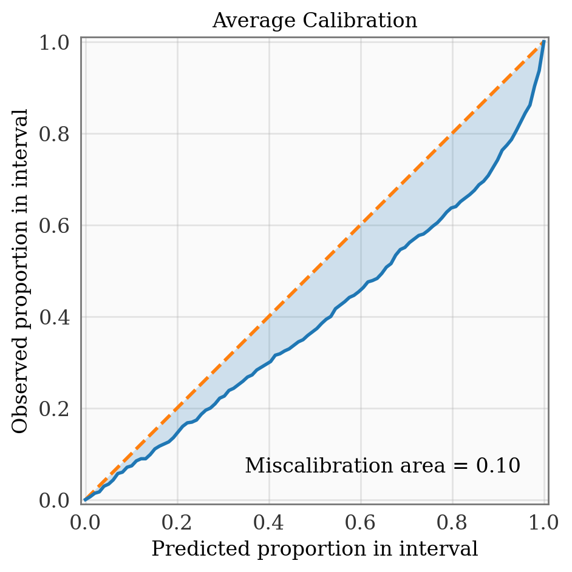
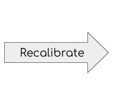
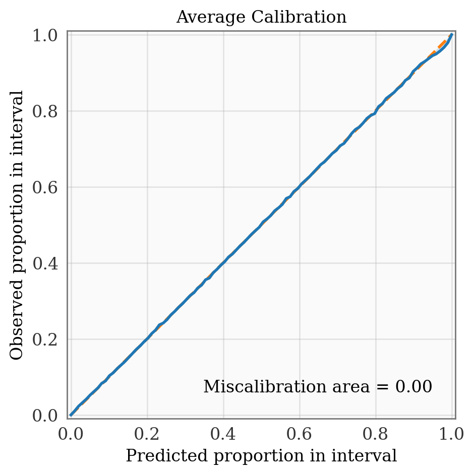
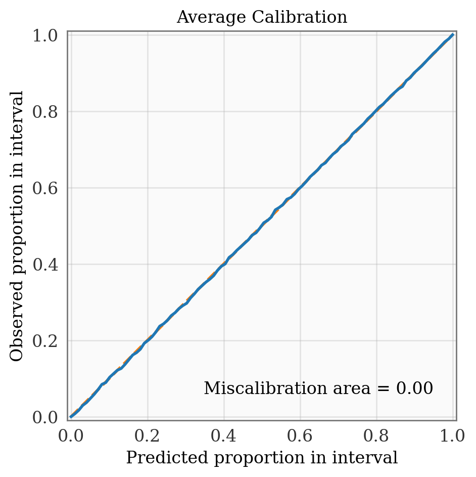

# Uncertainty Toolbox

<br/>

**Uncertainty Toolbox**
> A python toolbox for predictive uncertainty quantification, calibration,
> [metrics, and visualization](#metrics).\
> Also: a [glossary of useful terms](docs/glossary.md) and a collection
> of [relevant papers and references](docs/paper_list.md).

&nbsp;\
Many machine learning methods return predictions along with uncertainties of some form,
such as distributions or confidence intervals. This begs the questions: How do we
determine which predictive uncertanties are best? What does it mean to produce a _best_
or _ideal_ uncertainty? Are our uncertainties accurate and _well calibrated_?

Uncertainty Toolbox provides standard metrics to quantify and compare predictive
uncertainty estimates, gives intuition for these metrics, produces visualizations of
these metrics/uncertainties, and implements simple "re-calibration" procedures to
improve these uncertainties.  This toolbox currently focuses on regression tasks.


## Toolbox Contents

Uncertainty Toolbox contains:
* [Glossary](docs/glossary.md) of terms related to predictive uncertainty
  quantification.
* [Metrics](uncertainty_toolbox/metrics.py) for assessing quality of predictive
  uncertainty estimates.
* [Visualizations](uncertainty_toolbox/viz.py) for predictive uncertainty estimates and
  metrics.
* [Recalibration](uncertainty_toolbox/recalibration.py) methods for improving the calibration of a
  predictor.
* Relevant [publications and references](docs/paper_list.md) on metrics and methods.


## Installation

Uncertainty Toolbox requires Python 3.6+. To install, clone and `cd` into this repo, and run:
```
$ pip install -e .
```


## Quick Start

```python
import uncertainty_toolbox as uct

# Load an example dataset of 100 predictions, uncertainties, and observations
predictions, predictions_std, y, x = uct.data.synthetic_sine_heteroscedastic(100)

# Compute all uncertainty metrics
metrics = uct.metrics.get_all_metrics(predictions, predictions_std, y)
```
This example computes [metrics](#metrics) for a vector of predicted values
(`predictions`) and associated uncertainties (`predictions_std`, a vector of standard
deviations), taken with respect to a corresponding set of observed values `y`.


## Metrics

The [`get_all_metrics`](uncertainty_toolbox/metrics.py#L51) function will return metrics
for:
1. __average calibration__: _mean absolute calibration error, root mean squared calibration error, miscalibration area_
2. __adversarial group calibration__: _mean absolute adversarial group calibration error, root mean squared adversarial group calibration error_
3. __sharpness__: _expected standard deviation_
4. __proper scoring rules__: _negative log-likelihood, continuous ranked probability score, check score, interval score_
5. __accuracy__: _mean absolute error, root mean squared error, median absolute error, coefficient of determination, correlation_


## Visualizations

The following plots are a few of the visualizations provided by Uncertainty Toolbox. See
[this example](examples/viz_synth_sine.py) for code to reproduce these plots.

**Overconfident** (_too little uncertainty_)
<p align="center">


</p>

**Underconfident** (_too much uncertainty_)
<p align="center">


</p>

**Well calibrated**
<p align="center">


</p>

And here are a few of the calibration metrics for the above three cases:

|              | Mean absolute calibration error (MACE) | Root mean squared calibration error (RMSCE) | Miscalibration area (MA) |
| :----- | :-----: | :-----: | :-----: |
| Overconfident | 0.19429 | 0.21753 | 0.19625 |
| Underconfident | 0.20692 | 0.23003 | 0.20901 |
| Well calibrated | 0.00862 | 0.01040 | 0.00865 |

## Recalibration

The following plots show the results of a recalibration procedure provided by
Uncertainty Toolbox, which transforms a set of predictive uncertainties to improve
average calibration. See [this example](examples/viz_recalibrate.py) for code to
reproduce these plots.

**Recalibrating overconfident predictions**
<p align="center">



</p>

|              | Mean absolute calibration error (MACE) | Root mean squared calibration error (RMSCE) | Miscalibration area (MA) |
| :----- | :-----: | :-----: | :-----: |
| Before Recalibration | 0.10305 | 0.11518 | 0.10409 |
| After Recalibration | 0.00178 | 0.00302 | 0.00153 |

**Recalibrating underconfident predictions**
<p align="center">



</p>

|              | Mean absolute calibration error (MACE) | Root mean squared calibration error (RMSCE) | Miscalibration area (MA) |
| :----- | :-----: | :-----: | :-----: |
| Before Recalibration | 0.29548 | 0.33284 | 0.29846 |
| After Recalibration | 0.00170 | 0.00222 | 0.00150 |

## Citation

If you use this toolbox, please consider citing one of the papers that led to its
development:
```
@article{chung2020beyond,
  title={Beyond Pinball Loss: Quantile Methods for Calibrated Uncertainty Quantification},
  author={Chung, Youngseog and Neiswanger, Willie and Char, Ian and Schneider, Jeff},
  journal={arXiv preprint arXiv:2011.09588},
  year={2020}
}

@article{tran2020methods,
  title={Methods for comparing uncertainty quantifications for material property predictions},
  author={Tran, Kevin and Neiswanger, Willie and Yoon, Junwoong and Zhang, Qingyang and Xing, Eric and Ulissi, Zachary W},
  journal={Machine Learning: Science and Technology},
  volume={1},
  number={2},
  pages={025006},
  year={2020},
  publisher={IOP Publishing}
}
```
